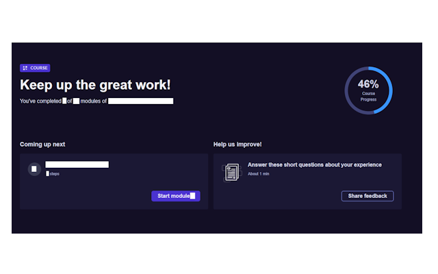
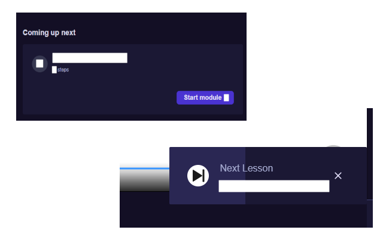

# Pluralsight™ Autoplay

This Chrome Extension is designed to **dynamically and repeatedly click buttons**  on a webpage with frequently updating content, such as in Single Page Applications (SPA). It leverages a `MutationObserver` to track changes in the DOM and react only when necessary. Here's what it does: 

1. **Listens for DOM changes:** 
It uses a `MutationObserver` to detect when the specified button is added to or reappears in the DOM.
 
2. **Validates button visibility:** 
Before clicking, it ensures the button is visible on the page (i.e., not hidden, transparent, or removed).
 
3. **Continuously handles dynamic content:** 
The script works persistently, clicking the button each time it appears or reappears.
 
4. **Reusability:** 
The `autoClickButton` function accepts an `XPath` selector, making it adaptable to various buttons.
 
5. **Why is it more efficient than `setInterval`?** 
Unlike `setInterval`, which repeatedly executes code at fixed intervals regardless of whether a button appears, `MutationObserver` reacts only when the DOM changes. This minimizes CPU usage, avoids unnecessary checks, and ensures the script works in sync with the dynamic updates of the page.
---

## Screenshots

Enjoy it :blush: